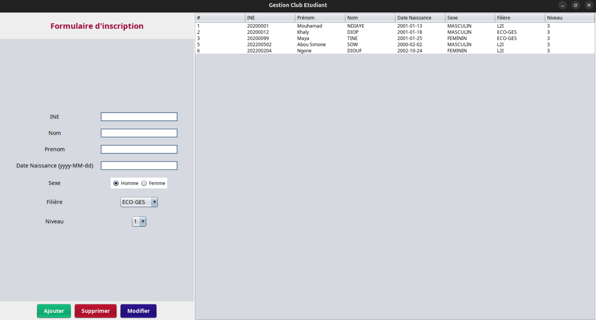
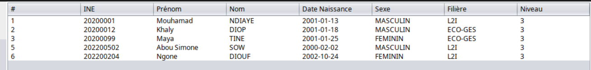

# Gestion Club Etudiant

## Description

L'application **Gestion Club Etudiant** est un outil de gestion des étudiants et des filières dans un environnement académique. Elle permet d'ajouter, modifier, supprimer et afficher les informations des étudiants, tout en gérant les filières disponibles. L'application est construite avec **Java** et utilise une base de données relationnelle pour stocker les informations.

## Fonctionnalités

- **Gestion des étudiants** : Ajout, modification, suppression et affichage des informations des étudiants.
- **Gestion des filières** : Ajout, modification et suppression des filières.
- **Interface graphique utilisateur** : Utilisation de **Swing** pour l'interface graphique, permettant une navigation simple.
- **Base de données** : Utilisation de **JPA (Java Persistence API)** pour la gestion des données.

## Prérequis

Avant d'exécuter l'application, vous devez avoir les éléments suivants installés sur votre machine :

- **Java Development Kit (JDK 8 ou supérieur)** : Nécessaire pour compiler et exécuter l'application.
- **Base de données relationnelle** (MySQL,Mariadb, PostgreSQL, etc.) : Pour stocker les informations des étudiants et des filières.
- **IDE** comme IntelliJ IDEA, Eclipse, ou NetBeans pour ouvrir le projet.

## Installation

### 1. Cloner ou télécharger le projet

Clonez le projet avec Git ou téléchargez l'archive ZIP :

```bash
git clone https://github.com/eadarak00/gestion_etudiant_swing
```


### 3. Importer le projet dans un IDE

- Ouvrez le projet dans votre IDE préféré.
- Compilez et exécutez le projet.

### 4. Lancer l'application

Pour lancer l'application :

```bash
mvn exec:java
```

## Structure du Projet
Voici une structure du projet pour le README :

```
src/  
│── main/  
│   ├── java/sn/m1/uasz/tp3/  
│   │   ├── dao/                     # Gestion des accès aux données  
│   │   ├── gui/                     # Interface graphique  
│   │   │   ├── MainFrame.java       # Fenêtre principale  
│   │   ├── model/                   # Modèles de données  
│   │   │   ├── enums/               # Enumérations  
│   │   │   │   ├── Etudiant.java  
│   │   │   │   ├── Filiere.java  
│   │   ├── service/                  # Services applicatifs  
│   │   │   ├── Initializer.java      # Initialisation du projet  
│   │   │   ├── Main.java             # Point d'entrée de l'application  
│   │   ├── resources/                # Fichiers de configuration et ressources  
│── test/                             # Tests unitaires et fonctionnels  
│── target/                           # Fichiers générés après compilation  
│── .gitignore                        # Fichiers à ignorer par Git  
│── pom.xml                           # Configuration du projet Maven  
│── README.md                         # Documentation du projet  
```

Le projet est organisé de la manière suivante :

- **MainFrame.java** : La fenêtre principale de l'interface utilisateur. Elle contient les boutons et les champs pour interagir avec les étudiants et les filières.
- **Etudiant.java** : La classe qui représente un étudiant, avec des attributs tels que le nom, prénom, niveau, sexe, date de naissance, et filière. Elle est mappée à la base de données.
- **Filiere.java** : La classe représentant une filière académique. Elle est associée à plusieurs étudiants.
- **EtudiantService.java** : Service responsable des opérations CRUD (Create, Read, Update, Delete) sur les étudiants.
- **FiliereService.java** : Service pour gérer les opérations sur les filières.
- **JpaUtil.java** : Utilitaire pour gérer la connexion à la base de données via **JPA**.
- **Initializer.java** : Classe pour insérer des données de test (ex. : ajout des filières par défaut).
- **Main.java** : Classe principale qui initialise l'application.

## Fonctionnalités détaillées

### Ajouter un étudiant
L'utilisateur peut ajouter un étudiant en remplissant un formulaire avec les informations suivantes : prénom, nom, date de naissance, sexe, niveau et filière. L'application insère ensuite ces informations dans la base de données.

### Modifier un étudiant
Les utilisateurs peuvent mettre à jour les informations des étudiants existants. Les champs sont modifiables et une fois enregistrés, les changements sont appliqués dans la base de données.

### Supprimer un étudiant
Un étudiant peut être supprimé de la base de données en sélectionnant l'étudiant dans la liste et en cliquant sur le bouton "Supprimer".

### Ajouter une filière
L'utilisateur peut ajouter de nouvelles filières académiques, et chaque filière est associée à une liste d'étudiants.

### Modifier une filière
Il est possible de modifier les informations d'une filière, y compris son nom.

### Supprimer une filière
Une filière peut être supprimée, ce qui aura pour effet de dissocier les étudiants de cette filière.

## Captures d'écran

### Interface principale


### Ajout d'un étudiant


### Liste des étudiants


## Conclusion

Cette application offre une solution simple et efficace pour gérer les étudiants et les filières dans un environnement académique. Grâce à une interface graphique intuitive et une architecture bien définie, elle peut être facilement utilisée pour gérer les informations des étudiants dans une école ou une université.
